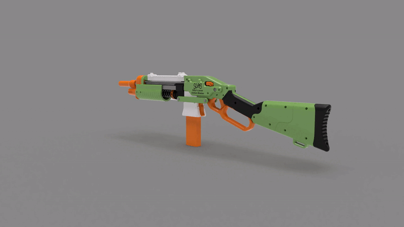
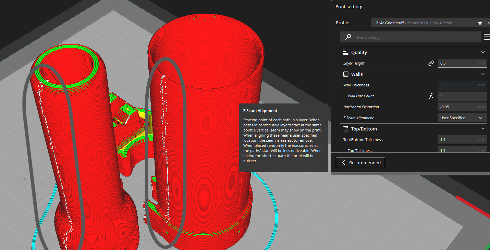

# SLAB
The SLAB: Silly's Lever Action Blaster. Talon fed lever action springer.

# IF YOU ARE HAVING ISSUES WITH YOUR BLASTER, CHECK THE TROUBLESHOOTING SECTION OF THIS PAGE. 

v4 (release) Changelog (click this text, it's a dropdown!)

- Changelog: 8-25-2022: Blaster release.
- Changelog: 9-5-2022: Updated parts. 
  - MuzzleB now has a hole for poking the catch pivot pin out from the other side. 
  - There is now a thicker MuzzleB in the alternate files folder, made to be stronger. The thicker MuzzleB does not fit Longshot springs. 
  - Added a split version of all the levers to the alternate file folder. These are to fit in very small printers, 150x150x150mm minimum build size. Without the split lever, minimum build size for the SLAB is 170x170x150mm. 
  - Fixed some magwells missing clearance cuts for the feedguide. If you have an old magwell, just shave the edges near the feedguide to make space for it. 
  - Updated the SidePanels to remove some old beta testing leftovers. On each side, I removed a slot for longer pins on the lever, and I removed an extra screw hole for the two side bars.
 - Changelog: 9-21-2022: Uploaded v4 assembly video: https://www.youtube.com/watch?v=RuWvdPNgs6U https://youtu.be/0BNuwjhlNqI 
 - Changelog: 9-22-2022: Updated and added parts.
   - Added a new massive lever as a joke. It's really big, but it technically works.
   - Added new top rail segments without picatinny rail on them for a smooth look.
   - Added a new MuzzleA without an elastic channel to go with the...
   - Updated hanguards and catches to have a spot for a Lynx or Longshot catch spring, if you don't like the elastic catch. These parts are compatible with both the spring and the elastic at the same time, just put in whichever you want. 
   - Updated CatchTighter to be -.5mm on each side, making it fit nicely right off the print bed. 
   - Updated both Turnarounds and all the magwells to move the screws that attach the two parts together. The new spot should be a lot stronger, and easier to reach while assembling. You can now reach the screws even if you already glued on your plunger tube.  
 - Changelog: 9-23-2022: Updated parts.
   - Updated the magwells and turnarounds (again) to make the attachment between the two stronger(er). More specifically, the dovetails are now slightly tighter, and they are also longer.
 - Changelog: 11-27-2022: Updated print guide to say that the 'PlungerHead' part should be at 100% infill.
 - Changelog: 3-18-2023: Tons of small changes and improvements:
 - - Added Vikinger/Liam Mattingly's logo to the inside of the stock. He was the designer of the original stock the SLAB stock was based upon. Liam passed away suddenly a few months ago. There is also a short message inside the F3D source file of the SLAB, in the sketches.
 - - Improved PlungerHead printing
 - - Improved printing on every part lol
 - - Added optional screw hole inside the right SidePanel for a screw. This is to then wrap a rubber band around the TriggerBlock, to tension the rod. That removes the rod wobble some people had trouble with.
 - - Added new optional top rail above the reciever of the SLAB. TopCoverTopRail is the filename. 
 - - Added experimental new ram with a cupped tip. This might improve airflow and reduce squibs, but more testing is needed.
 - - Added experimental new trigger with better clearance with the lever. This should fix issues some people had where the trigger sticks in place near the end of the trigger pull.
 - - Added experimental new left side panel with more clearance for the trigger rod. This should reduce rubbing.
 - - Improved the magwell attachment to the turnaround. This was previously in the experimental folder, but is now the official main file. The tab on the bottom of the turnaround is thicker and more filleted, and there are now tightening wedges near the top of the dovetails that should make it less wiggly. 
 - - Improved the screw holes on the optional bottlenose front ends to print nicer.
 - - Added a little hook to the inside of the small spring hole on the Catch (both variants). This should make installing the optional spring easier.
 - - Added optional spacers between the lever and the prime transfer bars. These spacers reduce wiggle. 
 - - Probably more improvements that I can't remember. I did a lot of these improvements months ago and forgot to write them down lol.
    
    
    
    
    
    
    

  

Firing demo: https://www.youtube.com/watch?v=BpF1ejbNk0Q

## Description

**FOR ALL THE FILES YOU NEED TO PRINT, DOWNLOAD THE "STLs1 BASE FILES.zip" AND "STLs2 EXPERIMENTAL AND OPTIONAL.zip" FILES! THEY ARE HERE:** https://github.com/Sillybutts/SLAB/blob/main/SLAB%20v4%20Release/STLs1%20BASE%20FILES.zip https://github.com/Sillybutts/SLAB/blob/main/SLAB%20v4%20Release/STLs2%20EXPERIMENTAL%20AND%20OPTIONAL.zip

**The minimum build volume for the SLAB is 150x150x150mm with alternate Lever parts. 170x170x150mm with all the standard parts. Remember to rotate parts to make them fit on your bed optimally.**

SLAB ASSEMBLY VIDEO: https://www.youtube.com/watch?v=RuWvdPNgs6U (watch at 1.25x speed, I ramble a bit)
Alternate assembly video (OOD): https://www.youtube.com/watch?v=PgvzgYeT_Lo

General blaster overview: https://youtu.be/Z2xsDboqWGA

Firing demo: https://www.youtube.com/watch?v=BpF1ejbNk0Q

The SLAB is a lever action, Talon mag fed, half dart springer.

## Reviews

Videos:
- OutOfDarts: https://www.youtube.com/watch?v=-3QmJG-iSTI
- Coop772: https://www.youtube.com/watch?v=0gnt4nkgSPQ
- Lorddraconical: https://www.youtube.com/watch?v=IG3rWt_11c0
- American Foam: https://www.youtube.com/watch?v=FAZ3mT-elwk
- Captain Xavier: https://www.youtube.com/watch?v=ifkdSixZSd4
- WalcomS7: https://www.youtube.com/watch?v=ACKjuRBVfR4
- Boomstick Mods: https://www.youtube.com/watch?v=W_mRjcNI2pQ&t=9s

## I don't charge for my files, please consider supporting me! 

**If you enjoy the stuff I make, please consider donating via Patreon or BuyMeACoffee. Filament and prototyping stuff costs a lot! By donating, I can make more cool stuff for everyone to enjoy. Thanks!**

 
https://www.patreon.com/sillybutts Monthly donations

 
https://www.buymeacoffee.com/sillybutts One-time donations

### Beta Tester Thanks

Thanks to my beta testers who contributed a bunch of features and variant parts to the SLAB! Here's a list of who did what: (click this text)

- Baygull made the first version of the Handguard wBackstop
- Baygull contributed the little pointy bits to the top rail that align it with the MuzzleB and TopCover
- Ehdrien contributed his fancy printed cotter pins
- Ehdrien made the first chopped Talon magwell by literally chopping the standard one at an angle in his slicer
- The nice handwriting on the SLAB logo is from Jessie (Silverfox), thanks for letting me add that to the blaster :)

Also, thanks to all my beta testers for their feedback while designing the SLAB. Couldn't have done it (this well) without you guys(and gals)!

- SuperStressed
- Ehdrien
- BansheeIndian
- BoomstickMods
- Junior7
- SilverFox (Jessie and Ryan)
- Nevets01
- Wonderboy
- CybranWarrior22

### Design Lineage

 As with many of my other designs, the SLAB is an amalgamation of several design ideas from other blasters. Here's a nice list: (click this text)

- SillyPistol derived plunger, catch, and top slide as handguard (heavily modified)
- Lynx derived turnaround (heavily modified)
- Vikinger custom FLAK stock & lever (heavily modified)
- FLAK derived trigger & lever (heavily modified)
- Chimera mk7 trigger linkage (inspired)
- Medusa magwell-to-lever connection (inspired, previously done by FLAK)
- Skewer derived magwell (heavily modified)
- Caliburn and Talon Claw priming bars used as reinforcement

  
  

### Sights

The blaster comes with front and rear iron sights in the White STL folder. The holes in my sights are sized for 1.75mm filament. The sights are held in place by two 4-40 screws per sight. 

Here are some good alternate Picatinny sights if you want something other than mine:
- https://www.thingiverse.com/thing:2376150/files FrontPip and Pip in the Caliburn fileset are great iron sights.
- https://www.thingiverse.com/thing:1667830
- https://www.thingiverse.com/thing:2829229
- https://www.thingiverse.com/thing:5103083

### Performance:
As testing is done, I will update this part of the page with common spring/barrel combos for specific FPS numbers.

Keep in mind that SCARs usually reduce performance a bit. If you plan to use a SCAR, make sure your barrel is long enough to come out the end of the muzzle for attaching the SCAR. Also keep in mind that a SCAR acts as a barrel lengthener to some extent. 

I usually recommend 12 inch barrel + MegaXL Spigot SCAR with SF25-TC or 5.5" k25 for maximum reasonable performance on the SLAB. It should hit ~220 fps.

**788, 4.5 INCH LENGTH**: 
- 10in/25cm barrel: 130 FPS
- 12in/30cm barrel: UNKNOWN FPS
- 14in/35cm barrel: UNKNOWN FPS

**788, Talon Claw LENGTH**: 
- 10in/25cm barrel: UNKNOWN FPS
- 12in/30cm barrel: UNKNOWN FPS
- 14in/35cm barrel: UNKNOWN FPS

**K25, 4.5 INCH LENGTH**: 
- 10in/25cm barrel: UNKNOWN FPS
- 12in/30cm barrel: UNKNOWN FPS
- 14in/35cm barrel: UNKNOWN FPS

**K25, Talon Claw LENGTH**: 
- 10in/25cm barrel: UNKNOWN FPS
- 12in/30cm barrel: UNKNOWN FPS
- 14in/35cm barrel: 210 FPS

**SF25, Talon Claw LENGTH**: 
- 10in/25cm barrel: UNKNOWN FPS
- 12in/30cm barrel: UNKNOWN FPS
- 14in/35cm barrel: 220 FPS

### Barrel Length

To use the MegaXL Spigot SCAR, 40mm of barrel is needed past the muzzle (when in the firing position) to attach. With the short nut, 35 is needed.

The standard 10 inch SLAB barrel sticks out of the muzzle 28mm, so it can not use the Spigot SCAR.

12 inch barrels stick out 80mm.

14 inch barrels stick out 130mm.

### MegaXL Spigot SCAR

Included in the SLAB fileset is a SCAR that allows you to fire MegaXL darts, and have a fully air-sealed SCAR. 

Video: https://www.youtube.com/watch?v=pxkyayn5zLk

The scar has three parts to it: The SCAR barrel itself, a locking nut used to tighten it to the barrel, and an 016 o-ring that goes around the barrel. This o-ring is what the SCAR nut tightens against. 

If you lose the 016 o-ring, a rubber band can be used as a replacement to keep the SCAR in place. The rubber band will not provide the air seal to the SCAR, but that isn't necessary for it to function.

There is also a part called BarrelCap, which is basically just something to put over your muzzle so you don't core-sample someone with your sharp metal barrel. It connects to the barrel the same way as the normal SCAR. 

## Community Upgrades / Variant Parts
This section is reserved for when people make their own parts for the SLAB. 

These parts may not be updated to the current SLAB version. If you have issues, message the creator of the part.

If you made something neat for the SLAB, let me know about it! Email: IamSillybutts@gmail.com

- *IMPERIAL SPEC*
- - Chopped Magwell with a spring instead of elastic: https://www.printables.com/model/323885-slab-magwell-with-compression-spring
- - Barrel shroud/cover: https://www.printables.com/model/308896-slab-shroud
- - Marksman Kit (longer top rail, cheek riser stock, new muzzle attachment): https://www.printables.com/model/312661-slab-marksman-package
- - Mares Leg Kit (Short chopped stock, swoopy giant lever): https://www.printables.com/model/321813-slab-mares-leg-kit
- - Flat Face "modern" Trigger: https://www.printables.com/model/297608-slab-flat-trigger
- - TPU Priming Lever Sleeve: https://www.printables.com/model/392377-slab-tpu-grip-sleeve
- - SLAB Skeletonized Stock: https://www.printables.com/model/386480-slab-skeleton-stock
- - SLAB X Slingfire Muzzle: https://www.thingiverse.com/thing:5754622
- - Flat SLAB Buttplate: https://www.thingiverse.com/thing:5752277
- - SLAB N-Strike Barrel Lug: https://www.printables.com/model/316254-slab-n-strike-barrel-lug
- - SLAB N-Strike Stock Attachment Point: https://www.printables.com/model/338615-n-strike-stock-attachment-for-slab
- - Tenderizer Muzzle Plate: https://www.printables.com/model/338618-tenderizer-front-plate-for-slab
- - Paracord SLAB Handguard: https://www.printables.com/model/338606-paracord-slab-grip
- - SLAB Windowed Magwell: https://www.printables.com/model/338855-windowed-magwells-slab
- - Double Plunger Tube Abomination: https://www.thingiverse.com/thing:5663902 https://www.reddit.com/r/Nerf/comments/z6z8ic/double_plunger_slab_files/
- - Muzzle spacer for extremely short barrels on the SLAB: https://www.thingiverse.com/thing:5852265
- - Rail B extension: https://www.thingiverse.com/thing:5901435
- - Single dart loading mag block: https://www.printables.com/model/390947-nerf-talon-single-load-block-for-sillybutts-slab
- - Stock and side panel picatinny, EXTRA TACTICOOL: https://www.printables.com/model/380984-slab-picatinny-rails
- - Imperial spec bar cutting jig: https://www.printables.com/model/342896-slab-caliburn-talonclaw-4-hole-template-imperial
- - Mega XL dart holder (picatinny mounted) (for MXL Spigot SCAR): https://www.printables.com/model/292339-mega-vertebre-rail-mounted-megaxl-dart-holder
- - SLAB MLOK handguard (tacticool): https://www.printables.com/model/417044-slab-mlok-handguard-cut-at-an-angle

- *METRIC SPEC*
- - No current metric-specific parts.

- *CHINA SPEC* (SuperPineapple) https://www.acfun.cn/v/ac40062210
- - Very interesting stock and muzzle mods by misakimiku: https://www.thingiverse.com/thing:5833217
- - MLOK Tactical handguard by hitako:https://www.thingiverse.com/thing:5716677
- - Extra top rail by hitako: https://www.thingiverse.com/thing:5716674

## Hardware, Compatability, and Availability

If you have a V3 kit instead of a release v4 kit, please click this text for some V3 BETA KIT info. All other info on this page is for the V4 or current release of the SLAB.

  
The v3 bar BETA hardware can be converted to a release v4 hardware kit by swapping the TCv3 and Caliburn v3 bars to TC T4 and Caliburn C4 bars, adding 3x 10-32 short screws (the ones used to hold the foregrip on Talon Claws and Caliburns), and adding some more o-rings.

  v3 BAR BETA VERSION Changelog

- Changelog: 6-17-22: Updated the Turnaround to better support the barrel
- Changelog: 6-19-22: Updated the Rail and Handguard wPicatinny to have nicer picatinny. Requires supports. Updated bottlenose and bottlenose wSling parts to be thicker walled.
- Changelog: 6-20-22: Updated the Rail to be split in half for easier printing (RailA, RailB). Updated the Magwell and Turnaround to add a new part, FeedGuide. This makes the whole assembly sturdier and easier to print.
- Changelog: 6-21-22: Apparently the Handguard, Handguard wPicatinny, MuzzleA, MuzzleB, and the TC length MuzzleB had misaligned screw holes. No idea where that got borked in the cad process lol. Fixed the holes, and made the Handguards slightly thicker and easier to print.
- Changelog: 6-22-22: Updated the TopCover's back tab to fit into the reciever notches easier. Updated the side covers to have slightly more pin clearance. 
- Changelog: 6-30-22: Apparently the wrong Magwell part was uploaded. The new part has a separate feed lip portion. Do not print the magwell with integrated feed lips.
- Changelog: 7-3-22: Fixed screw head relief spacing in the side cover parts that had become misaligned between the first and second prototype SLAB prints.
- Changelog: 7-9-22: Added new Bottlenose parts with cutouts for SCAR clearance. Added some iron sights for the picatinny rail, with holes to jam filament into for extra snazziness. Edited the Turnaround to hold the barrel centered better. Added a shim/spacer for the picatinny rail, if you have a gap.
- Changelog: 7-20-22: Lots of changes! New muzzle with better barrel centering. New turnaround that prints nicer and lets you glue/screw the PT on easier, and put in the thumb screw nut easier. New lever variants. New ram for double o-rings. Priming Bars print nicer now. Pin caps added. Updated the trigger linkage bits to not loosen over time. Better Bottlenose parts with more barrel clearance. Longshot spring compatibility.
- Changelog: 7-22-22: Updated TriggerBlock to have a looser pivot hole.
- Changelog: 7-23-22: Tweaked the CatchPusher's rod hole to be slightly shallower, hopefully improving trigger feel.
- Changelog: 7-24-22: Removed the PinCap part, replaced with PrintedCotterPin from Ehdrien. They work a LOT better!
  
  
  

### Sellers
A full list of non-US sellers can be found here: https://www.stuffbysilly.com/wheretobuy

Hardware is available from these sellers:
- SilverFoxIndustries: https://silverfoxindustries.shop/collections/designs-by-sillybutts/products/slab-hardware-kit
- OutOfDarts: https://outofdarts.com/collections/new-products/products/slab-hardware-kit

Fully printed/assembled blasters are available from these sellers:
- SilverFoxIndustries: https://silverfoxindustries.shop/collections/designs-by-sillybutts/products/slab-sillys-lever-action-blaster
- SuperStressed3D: https://www.etsy.com/shop/SuperStressed3D
- OutOfDarts: https://outofdarts.com/collections/new-products/products/slab-blaster-kit
- BansheeIndian: https://www.etsy.com/shop/BansheesBlasters

Upgrade parts are available from these sellers:
- BansheeIndian: https://www.etsy.com/shop/BansheesBlasters
- Roboman Automation: WIP
- PinkDragonTuning: https://www.etsy.com/listing/1317966754/slab-tpu-buttplate

### Hardware notes:

Full hardware list/BOM: https://docs.google.com/spreadsheets/d/1rwOaMUxTBOt-3HkqtDI1B0x1Cw2i1hpLy2a5YOf-w4Q/

- Super glue or epoxy (or plumbers Goop, or hot glue or silicone or some other adhesive) is used to keep the plunger tube attached to the TurnaroundCap. MAKE SURE TO FOLLOW THE ASSEMBLY STEPS CORRECTLY WHEN ASSEMBLING THE PLUNGER AND TURNAROUND.
- Using an elastic hair tie instead of elastic cord for the catch is recommended for aesthetics, but not needed. 
- The blaster is designed for 4 inches of k25 with a 12 inch barrel. The barrel can be longer or shorter, and you can fit springs anywhere from 4 inches to 6 inches in the blaster. The blaster also fits Longshot springs, but be careful with using super strong springs. The blaster is meant to use 788 and k25. It can fit k26 and k14, but those springs WILL cause durability issues for minimal meaningful performance gains.

## Printing Info

All STLs were exported in print orientation. F3D & STEP source files are also provided.

**The minimum build volume for the SLAB is 150x150x150mm with alternate Lever parts. 170x170x150mm with all the standard parts. Remember to rotate parts to make them fit on your bed optimally.**

This blaster is designed for PLA parts. Printing in other filaments (like PETG) should be fine, but might lead to broken parts.

**Make sure the Z-Seam is set to have all the seams in one line for easy cleanup, or hide the seam some place where it doesn't matter or rub against parts. On the MuzzleB, excessive Z-Seam can rub against the plunger tube during the prime, making the prime feel awful. If your blaster is doing this, just sand down the Z-Seam(s). This setting is also very important on the SCAR.**

The GripPanel L/R parts need supports. CatchPusher *might* need supports, but it really depends on your printer's overhang performance. 

The RailA/B, Ram, RodCap, RodCapPivot, RodCapKeeper, and PrintedCotterPin parts require brims.

### Infills:
- Black: 
- - PlungerRod 100% Gyroid, 5+ walls.
- - Everything else, 20% Gyroid, 5 walls. 
- - GripPanels need support.

- White: 
- - All at 20% Gyroid, 5 walls. 
- - Rails A/B need a brim and MUST be printed on the flat end.

- Orange: 
- - Muzzle attachments (Bottlenose, end caps, etc), Ram, RodCap, RodCapPivot, RodCapKeeper, PrintedCotterPin (x2), PlungerHead, Catch, and CatchPusher 100% 5 walls. 
- - Everything else, 20% Gyroid, 5 walls. 
- - The Ram, RodCap, RodCapPivot, RodCapKeeper, and PrintedCotterPin (x2) parts require brims.
- - The optional Bottlenose parts need supports.

- Green: 
- - StockPanels and StockCores at 10% gyroid, 4 walls. 
- - PrimeTransferBar (x2), 100% Gyroid, 5 walls.
- - Everything else, 20% Gyroid, 5 walls. 
- - The SideCovers L/R with text should be printed with THE TEXT NOT TOUCHING THE BUILD PLATE, using supports. The ones WITHOUT TEXT can be printed with the FLAT SIDE ON THE BUILD PLATE. This is done to keep the text nice and crisp. Maybe do a filament change on the layer before the letters to make them really pop!

### MegaXL Spigot SCAR Print Settings
Included in the SLAB fileset is a SCAR that allows you to fire MegaXL darts, and have a fully air-sealed SCAR. 

Print all of the SCAR at 5 walls 20% infill. No supports are necessary, but a brim might be needed to print smoothly.

Make sure the Z-Seam is straight down one side of the SCAR. Otherwise, it might not launch MegaXL as nicely, and it looks bad with misaligned Z-Seams.

## Assembly

Video: https://www.youtube.com/watch?v=RuWvdPNgs6U (watch at 1.25x speed, I ramble a bit)

Alternate assembly video (OOD): https://www.youtube.com/watch?v=PgvzgYeT_Lo

Plunger Tube Glue Guide: https://www.youtube.com/watch?v=0BNuwjhlNqI

- Super glue or epoxy (or plumbers Goop, or hot glue or silicone or some other adhesive) is used to keep the plunger tube attached to the TurnaroundCap. MAKE SURE TO FOLLOW THE ASSEMBLY STEPS CORRECTLY WHEN ASSEMBLING THE PLUNGER AND TURNAROUND.
- Put the -123 o-ring, the two 016 o-rings, and the nut/thumb screw into the turnaround BEFORE attaching the plunger tube.
- When using the split turnaround, put an 016 o-ring between the two parts, screw them together, then glue on the plunger tube.
- Using an elastic hair tie instead of elastic cord for the catch is recommended for aesthetics, and it makes assembly easier. The HW kits do not include these. 
- The blaster is designed for 4 inches of k25 with a 12 inch barrel. The barrel can be longer or shorter, and you can fit springs anywhere from 4 inches to 6 inches in the blaster. The blaster also fits Longshot springs, but be careful with using super strong springs. The blaster is meant to use 788 and k25. It can fit k26 and k14, but those springs WILL cause durability issues for minimal meaningful performance gains.
- Use the PrintedCotterPins to keep the two long takedown pins in place (the ones through the turnaround and the lever).
- There are two very small pins. The slightly longer one is for the mag release, the slightly shorter one is for the trigger.

## Troubleshooting and common issues

First off, thank you to my beta testers for helping me iron out the kinks in the SLAB before release. That said, there are still some common issues that people have. 

Thankfully, they are solveable. 

Blaster launches never go 100% smoothly, so please be understanding with any issues you have, as the design is still very fresh and hasn't gone through years of tweaking. 

The following are common issues with the SLAB. If your issue isn't listed here, please message me (contact info at the bottom of this page).
- Catch issues and/or gummy gritty trigger:
- - This is usually caused by the catch being oversized or too tight. Take off the handguard (6 small screws), and take out the catch. The catch should slide 100% freely in the muzzle area, no noticable friction. DO NOT LUBRICATE IT, take out the catch and use sandpaper on the sides until it slides freely. The handguard does not need to be installed in order to test the blaster, only put on the handguard at the end of testing the fix. SilverFoxIndustries SLABs from before Spring 2023 are especially succeptible to this issue.
- Flubs/Squibs: Flubs/Squibs are seemingly caused by several random things on the SLAB. Common causes include: 
- - Barrel too long for given spring weight. Try using a shorter/longer barrel. As testing is done, I will update this part of the page with common spring/barrel combos for specific FPS numbers.
- - Darts getting bent as they are chambered. This can be solved by changing which ram you are using. The flat face ram chambers smoother, but doesn't push the dart into the barrel as far as the pointy ram.
- - Roughly cut barrel ends grabbing onto darts as they go through the barrel. Solved by sanding or chamfering the ends of your barrel to be smoother.
- - Missing or broken o-rings around the barrel in the turnaround. Replace these o-rings if they break. Barrel o-rings can be broken by sharp edges on the ends of your barrel. As you put in the rough barrel, it cuts up the o-rings.
- - Bad seal between the plunger and turnaround. This can be solved with adding more glue to the connection between the plunger tube and the Turnaround.
- - Bad ram seal. This can be solved by printing the T or Tighter ram variant, or switching to the Lynx hardware ram (which is adjustable to much tighter levels). LUBE YOUR RAM O-RINGS!!!
- Catch won't catch or release: tighten/loosen catch elastic, thread in/out trigger linkage rod to push down the catch less/more. If your rod is threaded out too far, your catch won't catch the plunger. There is also a spot on the top of the trigger to put a 4-40 screw to fine tune trigger pull distance if needed.
- Gritty/sluggish prime: Can be caused by several things.
- - On the MuzzleB, excessive Z-Seam can rub against the plunger tube during the prime, making the prime feel awful. If your blaster is doing this, just sand down the Z-Seam.
- - Your Turnaround might be rubbing against the aluminum bars because the prints are too tight. If this is happening, sand down the prints where they are excessively rubbing.
- - You might have not lubed things correctly. The plunger tube needs lube, and the o-ring(s) on the ram need lube. **DO NOT LUBE THE BARREL O-RINGS.**
- Wobbly top picatinny rail: If it is wobbly front to back, print the RailSpacer part and put it between the two top rail segments. If it is wobbly up and down, put some tape on the aluminum bar inside the rails to act as a shim.

## Misc.

**If you build any of my designs, I'd love to see yours! Feel free to message me on Discord (Sillybutts#5905) or tag me on a post on Reddit (u/SillyTheGamer).**

**If you are having issues with any of my designs, let me know on Discord (Sillybutts#5905) or Reddit (u/SillyTheGamer).**

**If you wish to print and sell this item, please contact me for licensing. I can be reached on Discord (Sillybutts#5905) or Reddit (u/SillyTheGamer). iamsillybutts@gmail.com email too.**
**你好！ 我擁有這個設計。 想生產請聯繫我. 你好！ 我拥有这个设计。 如果你想生产，请联系我.**

 This work is licensed under a <a rel="license" href="http://creativecommons.org/licenses/by-nc-sa/4.0/">Creative Commons Attribution-NonCommercial-ShareAlike 4.0 International License</a>.

**Disclaimer: This is not a toy. This blaster is meant for hobbyists, not children. Blaster must be operated correctly to avoid injury. I am not responsible for any injuries from this blaster. Please use a bright/blaze orange muzzle and barrel cap on this blaster. Consult local laws before building this high powered blaster.**

## If you like what I do, please consider supporting me!

**I don't charge for my files, so any donations or merch purchases would be greatly appreciated!**

 https://www.redbubble.com/people/Sillybutts/shop RedBubble full of fun Nerf-y sticker and merch designs!  

 https://www.patreon.com/sillybutts Monthly donations

 https://www.buymeacoffee.com/sillybutts One-time donations

## Images

