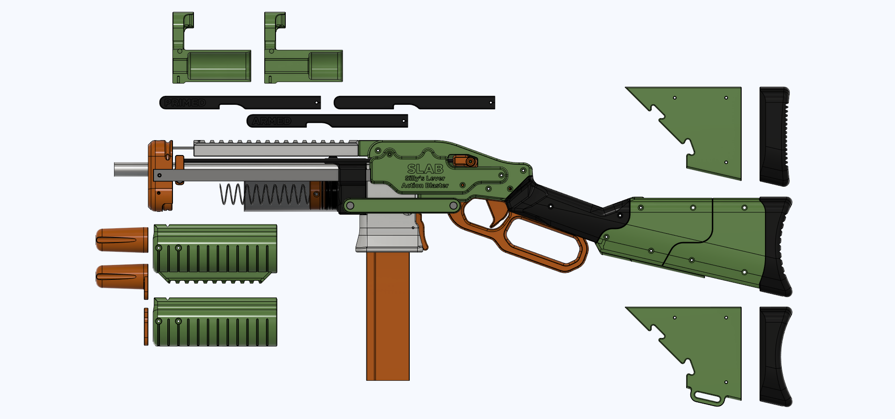

# SLAB
The SLAB: Silly's Lever Action Blaster. Talon fed lever action springer.

# BETA/UNFINISHED DESIGN, PRINT AT YOUR OWN RISK. SOURCE YOUR OWN HARDWARE FOR NOW, KITS COMING LATER™.

v4 (release) Changelog (click this text, it's a dropdown!)

- Changelog: 1-1-22: null
  

v3 BAR BETA VERSION Changelog (click this text, it's a dropdown!)

- Changelog: 6-17-22: Updated the Turnaround to better support the barrel
- Changelog: 6-19-22: Updated the Rail and Handguard wPicatinny to have nicer picatinny. Requires supports. Updated bottlenose and bottlenose wSling parts to be thicker walled.
- Changelog: 6-20-22: Updated the Rail to be split in half for easier printing (RailA, RailB). Updated the Magwell and Turnaround to add a new part, FeedGuide. This makes the whole assembly sturdier and easier to print.
- Changelog: 6-21-22: Apparently the Handguard, Handguard wPicatinny, MuzzleA, MuzzleB, and the TC length MuzzleB had misaligned screw holes. No idea where that got borked in the cad process lol. Fixed the holes, and made the Handguards slightly thicker and easier to print.
- Changelog: 6-22-22: Updated the TopCover's back tab to fit into the reciever notches easier. Updated the side covers to have slightly more pin clearance. 
- Changelog: 6-30-22: Apparently the wrong Magwell part was uploaded. The new part has a separate feed lip portion. Do not print the magwell with integrated feed lips.
- Changelog: 7-3-22: Fixed screw head relief spacing in the side cover parts that had become misaligned between the first and second prototype SLAB prints.
- Changelog: 7-9-22: Added new Bottlenose parts with cutouts for SCAR clearance. Added some iron sights for the picatinny rail, with holes to jam filament into for extra snazziness. Edited the Turnaround to hold the barrel centered better. Added a shim/spacer for the picatinny rail, if you have a gap.
- Changelog: 7-20-22: Lots of changes! New muzzle with better barrel centering. New turnaround that prints nicer and lets you glue/screw the PT on easier, and put in the thumb screw nut easier. New lever variants. New ram for double o-rings. Priming Bars print nicer now. Pin caps added. Updated the trigger linkage bits to not loosen over time. Better Bottlenose parts with more barrel clearance. Longshot spring compatibility.
- Changelog: 7-22-22: Updated TriggerBlock to have a looser pivot hole.
- Changelog: 7-23-22: Tweaked the CatchPusher's rod hole to be slightly shallower, hopefully improving trigger feel.
- Changelog: 7-24-22: Removed the PinCap part, replaced with PrintedCotterPin from Ehdrien. They work a LOT better!

## Licensing

**If you wish to print and sell this item, please contact me for licensing. I can be reached on Discord (Sillybutts#5905) or Reddit (u/SillyTheGamer).**

 This work is licensed under a <a rel="license" href="http://creativecommons.org/licenses/by-nc-sa/4.0/">Creative Commons Attribution-NonCommercial-ShareAlike 4.0 International License</a>.

## Description

General blaster overview: https://youtu.be/oZG_x506SXU

The SLAB is a lever action, Talon mag fed, half dart springer.

As with many of my other designs, the SLAB is an amalgamation of several design ideas from other blasters.
- SillyPistol derived plunger, catch, and top slide as handguard (heavily modified)
- Lynx derived turnaround (heavily modified)
- Vikinger custom FLAK stock (heavily modified)
- FLAK derived lever & trigger (heavily modified)
- Chimera mk7 trigger linkage (inspired)
- Medusa magwell-to-lever connection (inspired, previously done by FLAK)
- Skewer derived magwell (heavily modified)
- Caliburn and Talon Claw priming bars used as reinforcement

The blaster comes with front and rear iron sights in the White STL folder. The holes in them are sized for 1.75mm filament. They are held in place by two 4-40 screws per sight. 

Here are some good alternate Picatinny sights if you want something other than mine:
- https://www.thingiverse.com/thing:2376150/files FrontPip and Pip in the Caliburn fileset are great iron sights.
- https://www.thingiverse.com/thing:1667830
- https://www.thingiverse.com/thing:2829229
- https://www.thingiverse.com/thing:5103083

## Hardware, Compatability, and Availability

The v3 bar BETA hardware can be converted to a release v4 hardware kit by swapping the TCv3 and Caliburn v3 bars to TC T4 and Caliburn C4 bars, adding 3x 10-32 short screws (the ones used to hold the foregrip on Talon Claws and Caliburns), and adding some more o-rings.

Hardware is available from these sellers:
- SilverFoxIndustries: LINK

Fully printed/assembled blasters are available from these sellers:
- PERSON: LINK
- PERSON: LINK

Full hardware list/BOM: https://docs.google.com/spreadsheets/d/1rwOaMUxTBOt-3HkqtDI1B0x1Cw2i1hpLy2a5YOf-w4Q/

### Hardware notes:

- Super glue or epoxy is used to keep the plunger tube attached to the TurnaroundCap. MAKE SURE TO FOLLOW THE ASSEMBLY STEPS CORRECTLY WHEN ASSEMBLING THE PLUNGER AND TURNAROUND.
- Using an elastic hair tie instead of elastic cord for the catch is recommended for aesthetics, but not needed. 
- The blaster is designed for 4 inches of k25 with a 12 inch barrel. The barrel can be longer or shorter, and you can fit springs anywhere from 4 inches to 6 inches in the blaster. The blaster also fits Longshot springs, but be careful with using super strong springs. The blaster is meant to use 788 and k25. It can fit k26 and k14, but those springs WILL cause durability issues for minimal meaningful performance gains.
- Use the PrintedCotterPins to keep the two long takedown pins in place (the ones through the turnaround and the lever).
- There are two very small pins. The slightly longer one is for the mag release, the slightly shorter one is for the trigger.

## Printing Info

All STLs were exported in print orientation. F3D & STEP source files are also provided.

The GripPanel L/R parts need supports.

The RailA/B, Ram, RodCap, RodCapPivot, RodCapKeeper, and PrintedCotterPin parts require brims.

This blaster is designed for PLA parts. Printing in other filaments (like PETG) should be fine, but might lead to broken parts.

Infills:
- Black: 
- - PlungerRod 100% Gyroid, 5+ walls.
- - Everything else, 20% Gyroid, 5 walls. 
- - GripPanels need support.

- White: 
- - All at 20% Gyroid, 5 walls. 
- - Rails A/B need a brim and MUST be printed on the flat end.

- Orange: 
- - Muzzle attachments (Bottlenose, end caps, etc), Ram, RodCap, RodCapPivot, RodCapKeeper, PrintedCotterPin (x2), Catch, and CatchPusher 100% 5 walls. 
- - Everything else, 20% Gyroid, 5 walls. 
- - The Ram, RodCap, RodCapPivot, RodCapKeeper, and PrintedCotterPin (x2) parts require brims.
- - The optional Bottlenose parts need supports.

- Green: 
- - StockPanels and StockCores at 10% gyroid, 4 walls. 
- - PrimeTransferBar (x2), 100% Gyroid, 5 walls.
- - Everything else, 20% Gyroid, 5 walls. 
- - The SideCovers L/R with text should be printed with THE TEXT NOT TOUCHING THE BUILD PLATE, using supports. The ones WITHOUT TEXT can be printed with the FLAT SIDE ON THE BUILD PLATE. This is done to keep the text nice and crisp. Maybe do a filament change on the layer before the letters to make them really pop!

## Assembly

Video: WIP

## Misc.

**If you build any of my designs, I'd love to see yours! Feel free to message me on Discord (Sillybutts#5905) or tag me on a post on Reddit (u/SillyTheGamer).**

**If you are having issues with any of my designs, let me know on Discord (Sillybutts#5905) or Reddit (u/SillyTheGamer).**

**If you wish to print and sell this item, please contact me for licensing. I can be reached on Discord (Sillybutts#5905) or Reddit (u/SillyTheGamer).**

 This work is licensed under a <a rel="license" href="http://creativecommons.org/licenses/by-nc-sa/4.0/">Creative Commons Attribution-NonCommercial-ShareAlike 4.0 International License</a>.

## If you like what I do, please consider supporting me!

**I don't charge for my files, so any donations or merch purchases would be greatly appreciated!**

 https://www.redbubble.com/people/Sillybutts/shop RedBubble full of fun Nerf-y sticker and merch designs!  

 https://www.patreon.com/sillybutts Monthly donations

 https://www.buymeacoffee.com/sillybutts One-time donations

And here's my Etsy: https://www.etsy.com/shop/sillybuttsshop

## Images

